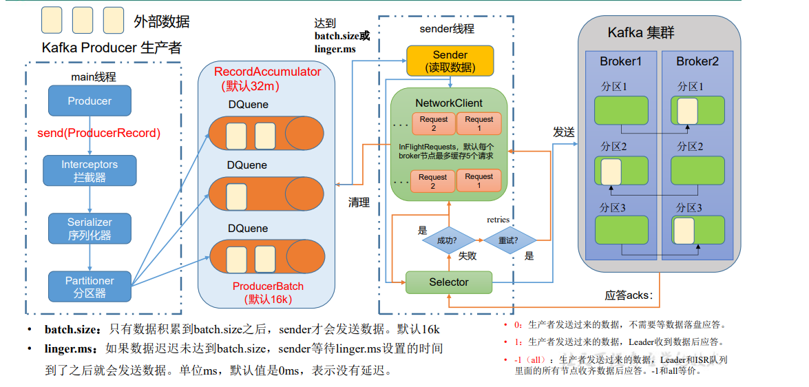
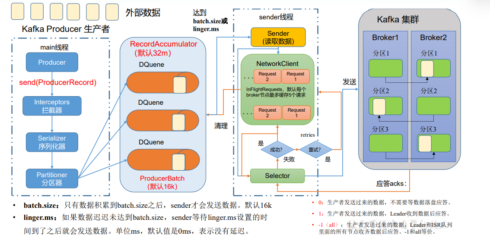

# Kafka简明教程
本教程基于三台kafka服务器，分别为master，node1，node2请确保上面已经安装了zk集群。
### 首先启动kafka
```shell
cd ~ && ./kafka/bin/kafka-server-start.sh -daemon /root/kafka/config/server.properties
```
对应的关闭命令是
```shell
cd ~ && ./kafka/bin/kafka-server-stop.sh
```
## Topic
查看topics的所有命令,在kafka的bin目录下执行
```shell
./kafka-topics.sh
```
链接到远程的kafka服务器
```shell
--bootstrap-server <String: server to    REQUIRED: The Kafka server to connect  
  connect to>                              to.     
```
增
```shell
--create                                 Create a new topic. 
```
删
```shell
--delete                                 Delete a topic  
```
改
```shell
--alter                                  Alter the number of partitions,        
                                           replica assignment, and/or  
```
查
```shell
--list                                   List all available topics. 
```
查询详细信息
```shell
--describe                               List details for the given topics. 
```
还可以指定分区，指定副本等等操作。
### Topic操作
### 查看topic列表
可以指定多台服务器链接,为了实现高可用,但是一般没有必要全部写,写个1-2台即可.
```shell
./kafka-topics.sh --bootstrap-server master:9092,node1:9092,node2:9092 --list
```
### 创建topic
指定1个分区,3个副本.副本数要小于集群的机器数量,否则会创建失败.分区数量没有限制.
```shell
./kafka-topics.sh --bootstrap-server master:9092,node1:9092,node2:9092 --topic second --create --partitions 1 --replication-factor 3
```
创建成功:
```shell
Created topic second.
```
创建失败,副本数大于brokers数量.
```shell
Error while executing topic command : Replication factor: 10 larger than available brokers: 3.
[2022-07-08 22:37:13,907] ERROR org.apache.kafka.common.errors.InvalidReplicationFactorException: Replication factor: 10 larger than available brokers: 3.
```
再次查看list
```shell
__consumer_offsets
__transaction_state
first
second
```
### 查看topic详细信息
```shell
./kafka-topics.sh --bootstrap-server master:9092,node1:9092,node2:9092 --topic first --describe
```
副本分别存储在三台机器上,其中2号机器是leader.
Isr的意思:Leader维护了一个动态的in-sync replica set（ISR），意为和
Leader保持同步的Follower+Leader集合(leader：0，isr:0,1,2)。

```shell
Topic: first	TopicId: 7QK-kZiEQUepWEdQ7xOUhA	PartitionCount: 3	ReplicationFactor: 3	Configs: segment.bytes=1073741824
Topic: first	Partition: 0	Leader: 2	Replicas: 0,2,1	Isr: 2,0,1
Topic: first	Partition: 1	Leader: 2	Replicas: 1,2,0	Isr: 2,0,1
Topic: first	Partition: 2	Leader: 2	Replicas: 2,0,1	Isr: 2,0,1

```
### 修改分区数
分区数只能改大,不能改小.
```shell
 ./kafka-topics.sh --bootstrap-server master:9092,node1:9092,node2:9092 --topic first --alter --partitions 5
```
```shell
Topic: first	TopicId: 7QK-kZiEQUepWEdQ7xOUhA	PartitionCount: 5	ReplicationFactor: 3	Configs: segment.bytes=1073741824
Topic: first	Partition: 0	Leader: 2	Replicas: 0,2,1	Isr: 2,0,1
Topic: first	Partition: 1	Leader: 2	Replicas: 1,2,0	Isr: 2,0,1
Topic: first	Partition: 2	Leader: 2	Replicas: 2,0,1	Isr: 2,0,1
Topic: first	Partition: 3	Leader: 0	Replicas: 0,2,1	Isr: 0,2,1
Topic: first	Partition: 4	Leader: 1	Replicas: 1,0,2	Isr: 1,0,2
```
### 修改副本数
无法通过命令行的方式修改副本,要借助其他手段.

## Producer
查看producer的所有相关命令.
```shell
./kafka-console-producer.sh 
```
连接到服务器上
```shell
--bootstrap-server <String: server to    REQUIRED unless --broker-list          
  connect to>                              (deprecated) is specified. The server
                                           (s) to connect to. The broker list   
                                           string in the form HOST1:PORT1,HOST2:
                                           PORT2.     
```

发送消息到指定的topic
```shell
--topic <String: topic>                  REQUIRED: The topic id to produce      
                                           messages to.  
```
### 链接server并指定topic
```shell
./kafka-console-producer.sh --bootstrap-server master:9092 --topic first
```

### 创建消费者,消费消息
```shell
./kafka-console-consumer.sh
```
连接至集群,指定topic,和上面差不多.

```shell
./kafka-console-consumer.sh --bootstrap-server master:9092 --topic first
```
此时在生产端(01服务器)输入, 就可以在消费端(02服务器)看到输出.
但是此时的消费无法读取到历史数据,此时可以加上参数
```shell
--from-begining
```
```shell
./kafka-console-consumer.sh --bootstrap-server master:9092 --topic first --from-beginning
```
此时即可打印出所有历史数据.
```shell
hello
pandy
```
### 发送原理


### 发送原理


## 分区
分区的好处:
1. 便于合理使用存储资源，每个Partition在一个Broker上存储，可以把海量的数据按照分区切割成一
   块一块数据存储在多台Broker上。合理控制分区的任务，可以实现负载均衡的效果。
2. 提高并行度，生产者可以以分区为单位发送数据；消费者可以以分区为单位进行消费数据。

## 提高吞吐量的一些方式
```java
// 缓冲区大小 32m
properties.put(ProducerConfig.BUFFER_MEMORY_CONFIG, 33554432);
// 批次大小
properties.put(ProducerConfig.BATCH_SIZE_CONFIG, 16384);
// linger ms 5-100ms, 权衡于批次大小和传输速度
properties.put(ProducerConfig.LINGER_MS_CONFIG, 1);
// 压缩 方式
properties.put(ProducerConfig.COMPRESSION_TYPE_CONFIG, "snappy");
```

## 消息可靠性的保证

参考上图的应答ack.ack为:
1. 0: 生产者发送过来的数据，不需要等数据落盘应答。
2. 1: 生产者发送过来的数据，Leader收到数据后应答。
3. -1（all）: 生产者发送过来的数据，Leader+和isr队列
里面的所有节点收齐数据后应答。-1和all等价。

但是有个问题,-1级别下,假如一个follow因为某些故障,导致与leader迟迟无法同步,该如何解决?

Leader维护了一个动态的in-sync replica set（ISR），意为和
Leader保持同步的Follower+Leader集合(leader：0，isr:0,1,2)。
如果Follower长时间未向Leader发送通信请求或同步数据，则
该Follower将被踢出ISR。该时间阈值由replica.lag.time.max.ms参
数设定，默认30s。例如2超时，(leader:0, isr:0,1)。
这样就不用等长期联系不上或者已经故障的节点。

如果分区副本设置为1个，或 者ISR里应答的最小副本数量
（ min.insync.replicas 默认为1）设置为1，和ack=1的效果是一
样的，仍然有丢数的风险（leader：0，isr:0）。

### 完全可靠性条件
数据完全可靠条件 = ACK级别设置为-1 + 分区副本大于等于2 + ISR里应答的最小副本数量大于等于2

### 可靠性总结
1. acks=0，生产者发送过来数据就不管了，可靠性差，效率高；
2. acks=1，生产者发送过来数据Leader应答，可靠性中等，效率中等；
3. acks=-1，生产者发送过来数据Leader和ISR队列里面所有Follwer应答，可靠性高，效率低；

在生产环境中，acks=0很少使用；acks=1，一般用于传输普通日志，允许丢个别数据；acks=-1，一般用于传输和钱相关的数据，
对可靠性要求比较高的场景。
